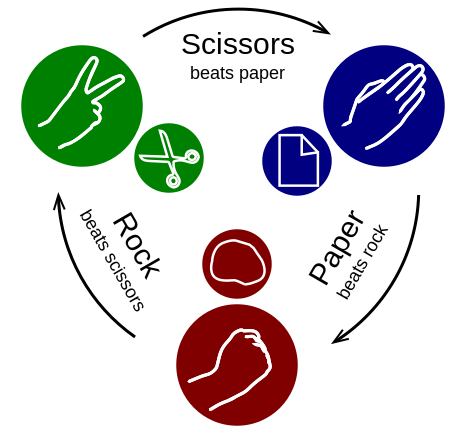

## User Story
* As a frequent game player,
* I’d like to play rock, paper, scissors
* So that I can spend an hour of my day having fun.

## Acceptance Criteria
* I should be able to play Player vs Computer.
* I should be able to play Computer vs Computer.
* Each new game should be a different game.
* [How to play](https://en.wikipedia.org/wiki/Rock%E2%80%93paper%E2%80%93scissors)
 

## Technical constraints
* Doesn’t necessarily need a flashy GUI.
* The solution should be easily runnable from command line.
* Third​ -party or external libraries should only be used for tests.

## Guidance
* Run and/or​ build instructions are seen in a positive light​, as it indicates you know how to work in that environment. Mention setup and execution instruction in a README file.
* We’re not too bothered with the UI. However, if you are mostly a frontend or mobile engineer a nice UI is a requirement​.
* We are keen to see how much you think is enough, and how much would go into a Minimum Viable Product. As a guide, elegant and simple​ wins over feature-rich every time.
* Do you test drive your code​? This is something we value and we will be looking for telling indicators of such in the code you produce.
* Do you care about how easy is for others to understand your code? Try to think if others would easily pick up from where you left.
* We also ​consider the extensibility of the code produced. A well-factored code should be relatively easily extended. ​[Rock​ paper​ scissors​ lizard​ Spock](https://en.wikipedia.org/wiki/Rock%E2%80%93paper%E2%80%93scissors#Additional_weapons) may be a natural extension.

* Follow the principles and general conventions of his or her programming language of choice.
* Use the language which you feel most comfortable with, but please do refrain from using esoteric languages​.
* We are expecting a well-modeled solution​. * Additionally, any indicator of design (​ DDD, or design patterns) would make us smile.
